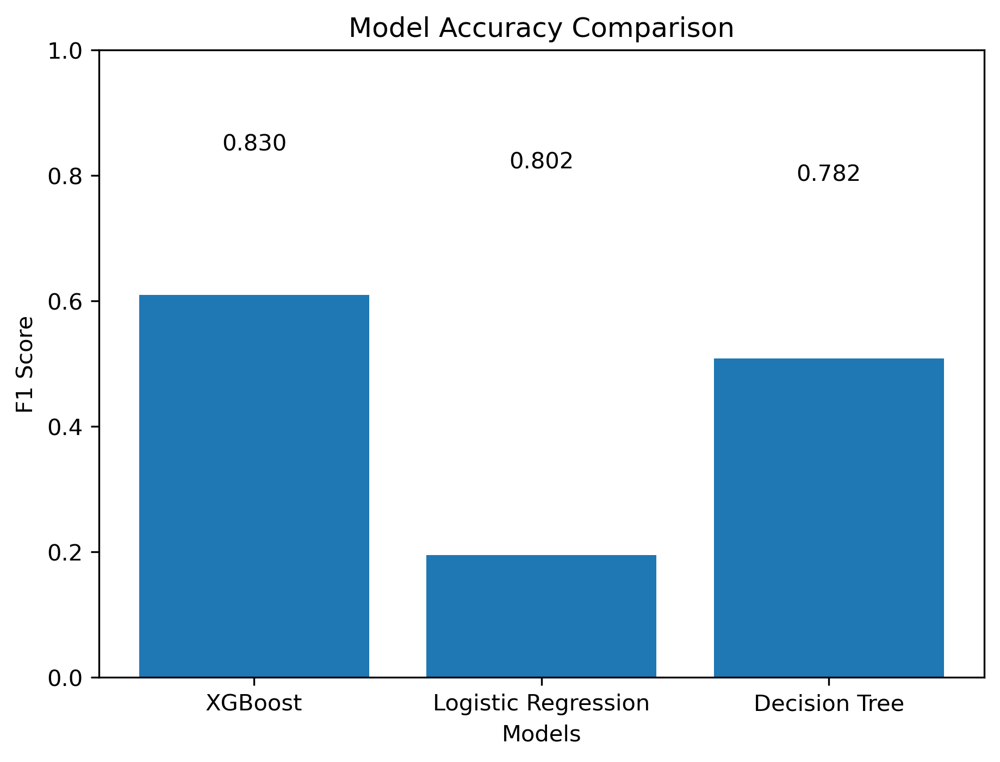
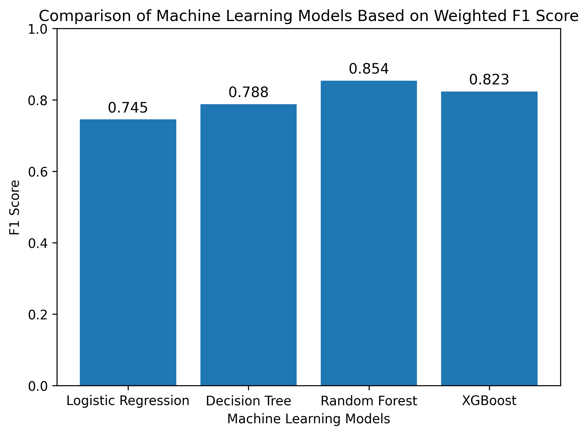
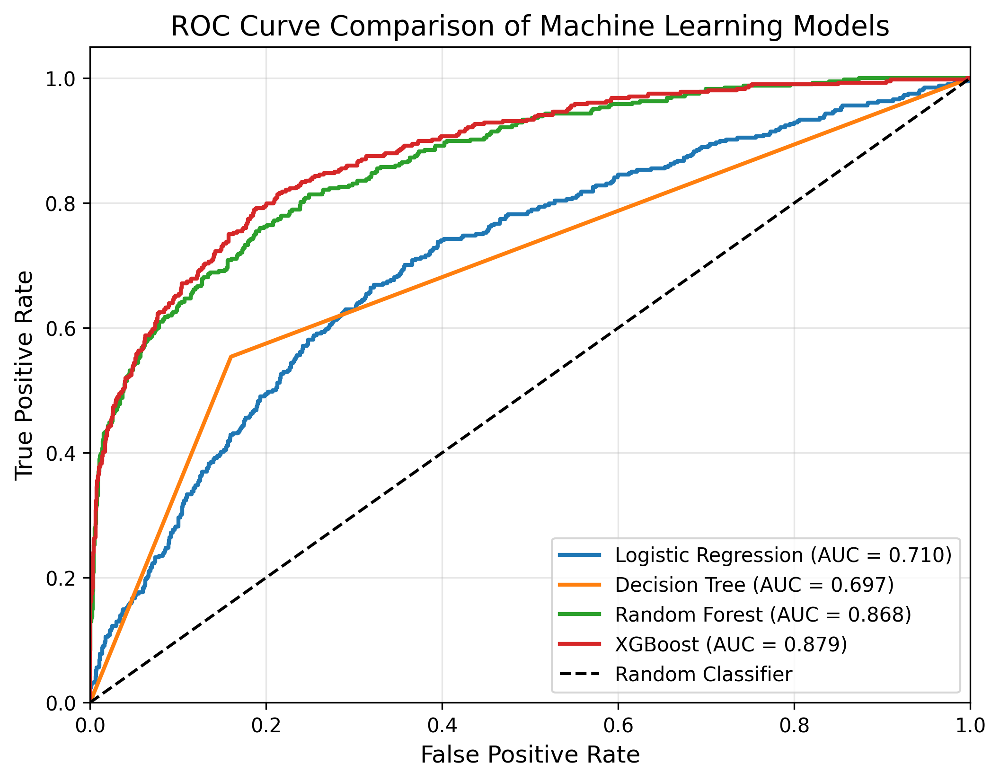

# Customer Churn Prediction using Machine Learning

## Overview

Customer churn prediction is an important task for banks and businesses seeking to improve customer retention. This project develops and compares multiple machine learning models to predict whether a customer is likely to leave the bank based on demographic and account-related information.

The project also incorporates hyperparameter tuning and evaluates each model using multiple performance metrics to identify the most effective approach.

---

## Dataset

The dataset contains customer information including:

- Credit Score
- Geography
- Gender
- Age
- Tenure
- Balance
- Number of Products
- Has Credit Card
- Is Active Member
- Estimated Salary

**Target Variable**

- **Exited = 1** → Customer Churned
- **Exited = 0** → Customer Retained

---

## Machine Learning Models

The following classification algorithms were implemented and compared:

- Logistic Regression
- Decision Tree Classifier
- Random Forest Classifier
- XGBoost Classifier

---

## Hyperparameter Tuning

To improve predictive performance, hyperparameter optimization was performed using **RandomizedSearchCV** for:

- Random Forest
- XGBoost

The tuned models were then evaluated and compared with the baseline models.

---

## Evaluation Metrics

Model performance was evaluated using:

- Accuracy
- Precision
- Recall
- F1 Score
- Confusion Matrix
- ROC Curve
- Area Under the Curve (AUC)

---

## Visualizations

The project includes the following visualizations:

### Model Accuracy Comparison

### Model F1 Score Comparison

### ROC Curve Comparison

---

## Technologies Used

- Python
- Pandas
- NumPy
- Matplotlib
- Scikit-learn
- XGBoost
- Jupyter Notebook

---

## Results

The implemented machine learning models were evaluated using multiple performance metrics.

Among the evaluated models:

- Logistic Regression served as the baseline classifier.
- Decision Tree provided an interpretable tree-based model.
- Random Forest improved predictive performance using an ensemble learning approach.
- XGBoost utilized gradient boosting with hyperparameter optimization for enhanced classification.

Hyperparameter tuning further improved the performance of Random Forest and XGBoost, leading to more reliable customer churn predictions.

---

## Future Enhancements

Possible improvements include:

- Feature Engineering
- Handling class imbalance using SMOTE
- K-Fold Cross Validation
- Decision Threshold Optimization
- Feature Importance Analysis
- Model Deployment using Flask or Streamlit

---

## Author

**Rutwik Pabitwar**
**Prerna Suman**
**Shivli Soni**
